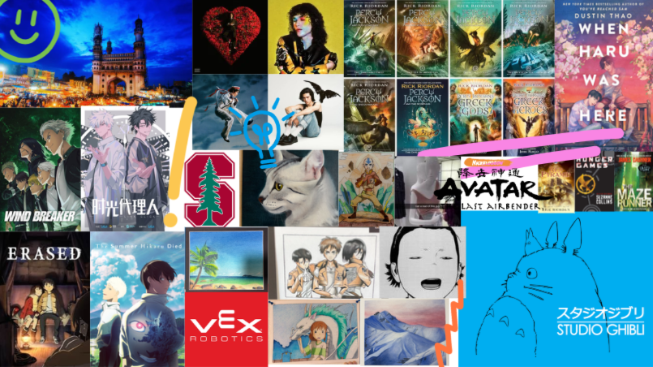

# Me-in-Markdown

## Introduction Letter to Mr. Aiello

***Hi Mr. Aiello!*** I'm Shaila (It's pronouced Shy-la). I'm a 9th grader. I attended Ernest Lawrence Middle School. You probably know about it, it's really close by. I came to Chatsworth a lot during middle school too because I did robotics for 7th and 8th grade. I was mainly a programmer and also team leader during our 8th grade season. We did pretty good in 8th grade. My team won 4 awards in total, 2 coming from the competetitions we participated in at Chatsworth. We also got the Think award which is an award for good programming and documentation in our engineering notebook :). ***Anyway,*** sorry I'll stop with robotics for now. Let's talk about basic stuff. I was born and raised in Calfornia and both my parents came here from India. I grew up in Canoga Park  but moved to Chatsworth a few years back. I'd have to say that my favorite part about living here is being able to go on late night drives with music on the whole time to pick up my mom from work. I love all the random hiking spots too. It's mostly just my dad whos into hiking, but he's kinds been rubbing off on me and honestly I have to say I like it too. I remember when we went to Yosemite and decided to go on the Mariposa Grove trail which was like 7 miles. ***(THAT THING WAS BRUTAL FOR 8 YEAR OLD ME)*** My parents never told me the hike was 7 miles so my confident little self started off really well and I was ahead of literally everyone else with us, but then by the time we were heading back my little 8 year old legs were giving up and my mom took the lead. :/ Anyway now whenever we want to go on a hike I kinda just force my parents to go to this one trail that has a free little library so I can get some books. (I have gotten some very good finds). Anyway since we've reached the topic of books lets move on to my interests. 

<u>My hobbies:</u>
1. Reading 
2. Drawing 
3. Listening to Music 
4. Crafting 
5. Watching shows

That's what I do when I'm bored which happens a lot, except sometimes I just stare at the ceiling and do nothing. I was hoping to be more productive over the weekends after school started but I infact spent the whole day reading. (That's still productive right?) I mean, you couldn't really get me to put the book the book down because I hit a plot twist just as I was thinking to do something else. Moving on I also love to draw. I mostly draw anime or realism, there's bascially no in between. If you look at my house you'll see a random acryllic cat I made in realism, and then a colored pencil drawing of Eren, Mikasa, and Levi from Attack on Titan. Moving on, you can probably assume that I love anime which is true. I'd have to say that <u>my all time favorites are:</u>

1. Wind Breaker 
2. Link Click
3. Erased 
4. Attack on Titan 
5. The Summer Hikaru Died

I also like to watch book adaptations like the Percy Jackson and the Olympians show and the Hunger Games. (***I am so excited because Percy Jackson season 3 and the new Hunger Games movie are coming out A DAY before my B-DAY***). Anyways, as I said I also love music and crafting. (They go so well together. One time I sat in my room with music on while spending like 3 hours painting this cardboard Percy Jackson sword I made myself). My top artist is Conan Gray. I love literally all his music. I also like Thomas Day and Olivia Rodrigo's music, or just some anime songs or songs from Epic: The Musical. 

<u>[This is my Spotify Playlist with all my repeat songs](https://open.spotify.com/playlist/4GogauZn7QWXi3CZWSOT8O?si=Bf6F-PXcTzuoztVk-EHb2A&utm_source=native-share-menu&pi=xbAC_7OXTHm52)</u>

Onto the conclusion of this letter. I guess I'll just talk about my summer. Basically the first half of my summer was taken up with **Summer Bridge at Chatsworth** and an online *Spanish 001* course that I did with Pierce College. I wouldn't say that the assignments were hard, but what I would say was that there were a lot more of them in a shortened amount of time. I did about 35-40 assignemnts per week for 5 weeks so it looks like I got the gist of a college workload. It was very helpful though because now I don't have to take a language during high school since I fulfilled the requirement over summer. :) After my summer classes were over ***I didn't really know what to do with my life so... yeah.*** But now we're back in school so here I am. Wow I didn't realize I wrote so much. Sorry for making you read so much Mr. Aiello.:] Oh yeah here are my favorite things in the collage, ok byeeeeeee.

